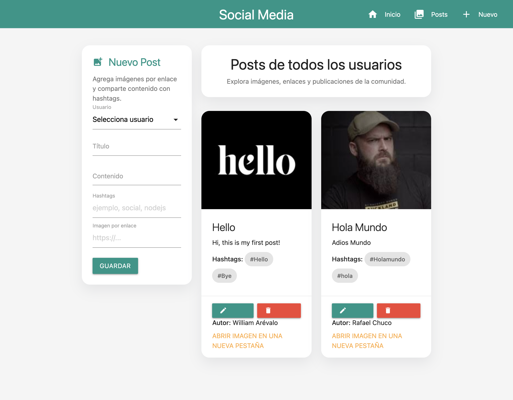
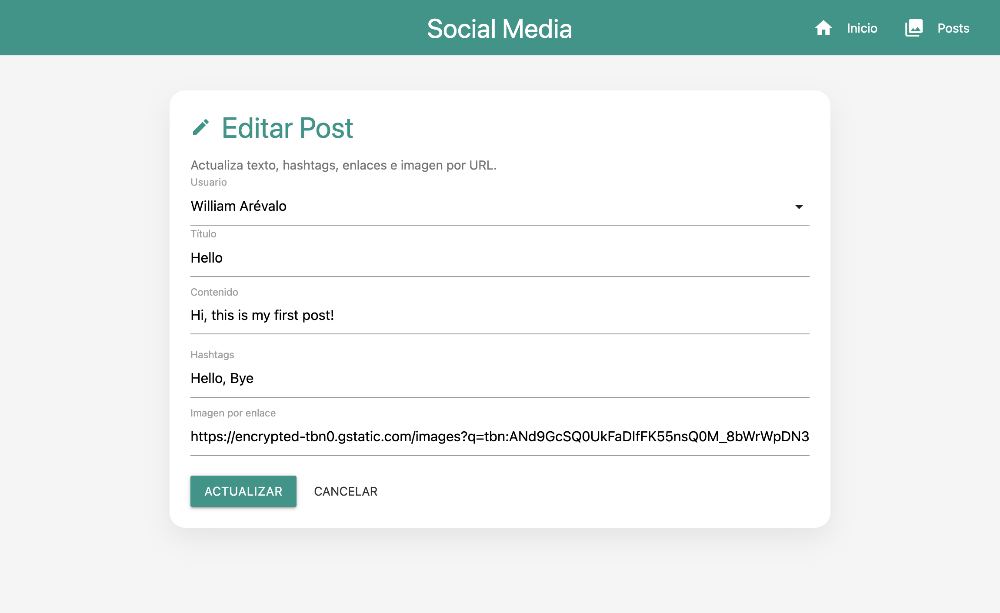

# Mongo Node Social Media

Aplicación web construida con **Node.js**, **Express**, **EJS** y **MongoDB/Mongoose** para gestionar usuarios y publicaciones de una red social simple.

## Funcionalidades

- Conexión a MongoDB con `mongoose`.
- Modelos robustos para `User` y `Post`.
- Patrón repositorio para separar acceso a datos.
- Vista principal con navegación clara.
- CRUD de posts desde la interfaz web.
- Soporte para imágenes por URL en cada post.
- Hashtags, enlaces y edición de publicaciones.

## Tecnologías

- Node.js
- Express
- EJS
- MongoDB
- Mongoose
- Nodemon

## Estructura del proyecto

```bash
mongo-node/
├── app.js
├── package.json
├── .env
├── .env.example
└── src/
    ├── controllers/
    ├── db/
    ├── models/
    ├── public/
    ├── repositories/
    ├── routes/
    ├── services/
    └── views/
```

## Modelos

### User

- `name`: String, required
- `lastName`: String, required
- `email`: String, unique, required
- `age`: Number, required, min 18
- `phoneNumber`: String
- `password`: String, required, minLength 8
- `createdAt`: Date, default `Date.now`

### Post

- `title`: String, required, minLength 5, maxLength 30
- `content`: String, required, minLength 10
- `hashtags`: Array de String
- `imageUrl`: String
- `createdAt`: Date, default `Date.now`
- `updatedAt`: Date
- `user`: ObjectId con referencia a `User`

## Vistas

- `/` → pantalla de bienvenida.
- `/posts` → listado, creación, edición y eliminación de posts.
- `/posts/edit/:id` → formulario de edición.

## Capturas

### Home


### Posts



### Editar Post



## Rutas principales

- `GET /` → home.
- `GET /posts` → listar posts.
- `GET /posts/new` → formulario visual de creación.
- `POST /posts` → crear post.
- `GET /posts/edit/:id` → editar post.
- `POST /posts/edit/:id` → actualizar post.
- `POST /posts/delete/:id` → eliminar post.

## Variables de entorno

El archivo [.env](.env) debe contener:

```env
PORT=3001
MONGO_URI=mongodb://localhost:27017/socialmedia
```

## Instalación

1. Instala dependencias:

```bash
npm install
```

1. Ejecuta el proyecto en desarrollo:

```bash
npm run dev
```

1. Ejecuta el proyecto en producción local:

```bash
npm run start
```

## Uso

1. Abre `http://localhost:3001`.
2. Entra a `Posts` para crear publicaciones.
3. Completa título, contenido, hashtags, URL de imagen y usuario.
4. Usa editar o eliminar desde cada tarjeta.

## Conclusión

El proyecto implementa una base sólida para una app social CRUD con una arquitectura clara: conexión a base de datos, modelos validados, patrón repositorio y vistas EJS separadas.
